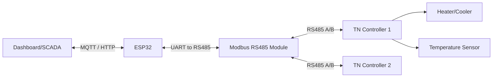
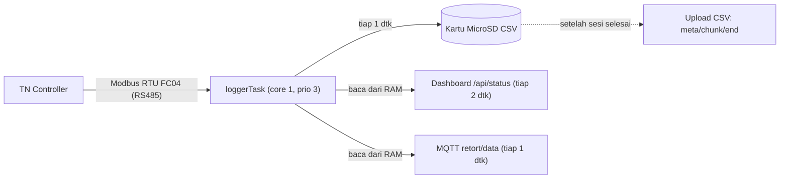
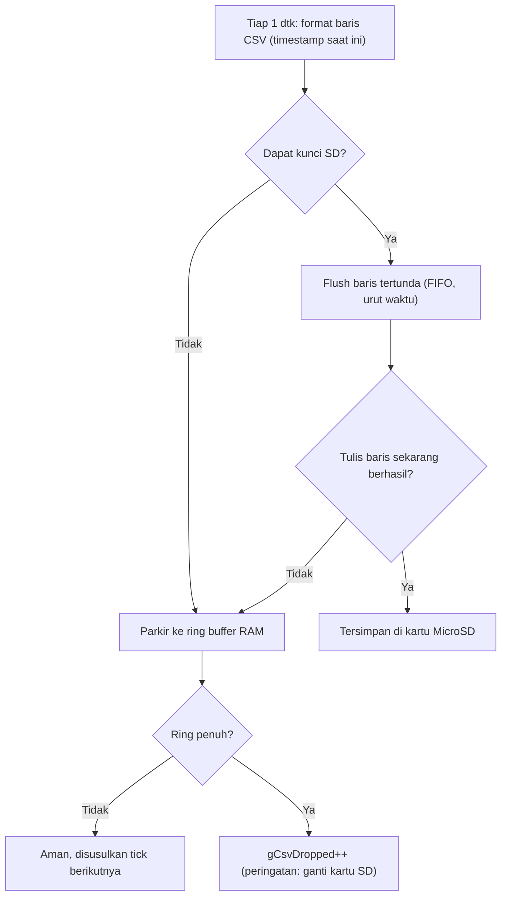

# Dokumentasi TN Series Modbus Communication

Dokumentasi ini adalah versi Markdown dari **Autonics TN Series Two-Degree-of-Freedom PID Temperature Controllers Communication Manual**. Dokumentasi ini dirancang agar lebih mudah dipahami oleh developer *firmware*, *backend*, engineer PLC, SCADA, dan ESP32, tanpa perlu membuka PDF asli.

## Daftar Isi Dokumentasi

Berikut adalah struktur folder dan cara membaca dokumentasi ini:

- `README.md` - Halaman utama ini.
- `01_Modbus_Basic.md` - Dasar-dasar protokol Modbus RTU & ASCII.
- `02_Coil_Map.md` - Pemetaan Coil (*Read/Force Coil*).
- `03_Discrete_Input.md` - Pemetaan Input Diskrit (*Read Discrete Input*).
- `04_Input_Register.md` - Pemetaan Input Register (*Read Input Register*).
- `05_Operation_Parameter.md` - Parameter operasi (400001+).
- `06_MultiSV.md` - Parameter Multi SV (400051+).
- `07_PID_Control.md` - Parameter Kontrol PID (400101+).
- `08_Input_Parameter.md` - Parameter Input Sensor (400151+).
- `09_Pattern_Parameter.md` - Parameter Pola Operasi (400201+).
- `10_Control_Parameter.md` - Parameter Kontrol Lanjutan (400301+).
- `11_PID_Group.md` - Parameter Grup PID 0 - 7 (400351+).
- `12_Event_Parameter.md` - Parameter Event (400451+).
- `13_Alarm_Output.md` - Output Alarm (400551+).
- `14_Communication.md` - Konfigurasi Komunikasi (400601+).
- `15_Other_Parameter.md` - Parameter Lainnya & Masking.
- `16_User_Parameter.md` - Grup Parameter User (DAQMaster).
- `17_PLC_Register.md` - Mapping Register untuk PLC.
- `Appendix.md` - Informasi tambahan seperti kode fungsi, error exception, format frame, dan troubleshooting.

## Topologi Modbus (Contoh ESP32 + RS485 + TN Controller)

Berikut adalah arsitektur sistem yang umum digunakan dalam menghubungkan perangkat IoT ke Autonics TN Series menggunakan Modbus RTU melalui RS485.



## Daftar Function Code yang Didukung

Autonics TN Series mendukung beberapa *Function Code* standar Modbus untuk membaca atau menulis data:

| Function Code (Hex) | Nama Fungsi | Deskripsi |
| --- | --- | --- |
| `01` (`0x01`) | Read Coil Status | Membaca status ON/OFF dari output (0X reference). |
| `02` (`0x02`) | Read Input Status | Membaca status ON/OFF dari input (1X reference). |
| `03` (`0x03`) | Read Holding Registers | Membaca data biner dari holding registers (4X reference). |
| `04` (`0x04`) | Read Input Registers | Membaca data biner dari input registers (3X reference). |
| `05` (`0x05`) | Force Single Coil | Mengubah satu koil menjadi ON atau OFF (0X reference). |
| `06` (`0x06`) | Preset Single Register | Menulis data biner ke satu holding register (4X reference). |
| `16` (`0x10`) | Preset Multiple Registers | Menulis data ke beberapa holding registers secara berurutan. |

## Daftar Register Group

Parameter pada TN Series dibagi berdasarkan jenis akses register Modbus:

| Group | Address | Range | Function Code | Deskripsi |
| --- | --- | --- | --- | --- |
| **Coil Status** | 000001+ | 000001 - 000050 | `01`, `05` | Kontrol RUN/STOP, Alarm Reset |
| **Discrete Inputs** | 100001+ | 100001 - 100100 | `02` | Status indikator (Suhu, LED, Event) |
| **Input Status** | 300101+ | 300101 - 300200 | `04` | Informasi versi perangkat & identitas keras |
| **Input Registers** | 301001+ | 301001 - 301050 | `04` | Pembacaan PV, Nilai output saat ini |
| **Holding Registers** | 400001+ | 400001 - 400750 | `03`, `06`, `16` | Parameter operasional (SV, PID, Alarm, Komunikasi) |
| **User Parameters** | 401022+ | 401022 - 402050 | `03`, `06`, `16` | Register yang dapat dikustomisasi |

## Contoh Komunikasi

Untuk komunikasi Modbus, selalu gunakan format Data Address yang tepat.

**Request: Read Holding Register (Baca Set Value pada address `400006`)**

- ID: `1`
- Function Code: `03`
- Address: `0x0005` (Hex dari 400006 - 400001 = 5)
- Quantity: `0x0001`

**Contoh kode Arduino/ESP32 (ModbusMaster):**

```cpp
#include <ModbusMaster.h>

ModbusMaster node;

void setup() {
  Serial.begin(115200);
  Serial2.begin(9600, SERIAL_8N1, 16, 17); // RS485 RX, TX
  node.begin(1, Serial2); // ID TN Controller = 1
}

void loop() {
  uint8_t result;
  
  // Membaca Set Value (Address 400006 -> Offset 0x0005)
  result = node.readHoldingRegisters(0x0005, 1);
  
  if (result == node.ku8MBSuccess) {
    Serial.print("Set Value: ");
    Serial.println(node.getResponseBuffer(0));
  } else {
    Serial.println("Gagal membaca Set Value");
  }
  
  delay(1000);
}
```

## Arsitektur RetortLogger: Akuisisi Async & Jaminan Zero-Loss

Bagian ini mendokumentasikan bagaimana firmware **RetortLogger** (ESP32-S3) membaca
data dari TN Controller lewat Modbus, mengirimnya secara *asynchronous* ke dashboard
dan MQTT, serta menjamin **tidak ada satu detik data pun yang hilang** selama sesi
sterilisasi. Dirangkum dari rangkaian perbaikan watchdog dan *zero-loss logging guard*.

### Prinsip utama

Data sterilisasi sangat berharga: kehilangan 1 baris berarti proses harus diulang
dari nol. Karena itu firmware memisahkan **jalur akuisisi/penyimpanan** (kritis, tidak
boleh telat) dari **jalur jaringan** (boleh lambat) ke task dan core yang berbeda.



Poin kunci: **dashboard dan MQTT membaca dari RAM (`state.*`), bukan dari kartu SD.**
Jadi tampilan live tetap real-time tanpa delay, sementara sumber kebenaran data tetap
di kartu MicroSD.

### Pembagian task & core

| Konteks | Core | Prioritas | Tugas |
| --- | --- | --- | --- |
| `loggerTask` | 1 | 3 (tinggi) | Baca Modbus PV/SV/MV + tulis 1 baris CSV, tepat tiap 1000 ms (`vTaskDelayUntil`) |
| `loop()` Arduino | 1 | 1 | WiFi, MQTT, NTP, upload CSV — boleh lambat |
| AsyncTCP | 0 | - | Web server (dashboard, settings, storage) |
| WiFi/TCP stack | 0 | - | Internal Espressif |

Karena `loggerTask` berprioritas lebih tinggi, walau `loop()` mandek oleh jaringan,
pengambilan dan penulisan data **tetap jalan tepat waktu**.

### Alur data asynchronous

1. **Akuisisi (1 dtk):** `loggerTask` melakukan satu transaksi Modbus FC04
   (`0x03E8` × 24 register) untuk PV, SV, MV, RUN/STOP, Pattern/Step, TOT, STP,
   lalu menyimpannya ke `state.*` di RAM.
2. **Penyimpanan utama (1 dtk):** baris CSV ditulis ke kartu MicroSD
   `/retort/YYYYMMDD_HHMMSS.csv` di task yang sama (satu konteks, dilindungi mutex).
3. **Live monitoring:** dashboard menarik `state.*` dari RAM tiap 2 dtk; MQTT
   `retort/data` mengirim tiap 1 dtk. Keduanya **tidak menyentuh kartu SD**.
4. **Upload setelah selesai:** saat sesi berhenti, file ditutup dan diberi marker
   `.ready`. Firmware lalu mengirim CSV lengkap via `retort/csv/meta` → `chunk` → `end`;
   bridge memverifikasi SHA-256 lalu impor dalam satu transaksi dan membalas ACK.

### Perbaikan Watchdog (anti-reboot saat blocking)

Watchdog reset (`TASK_WDT`/`INT_WDT`) terjadi bila sebuah task tertahan terlalu lama.
Semua *blocking call* panjang di `loop()` dihilangkan:

| Penyebab lama | Perbaikan |
| --- | --- |
| Sinkron NTP memblok `loop()` hingga ~18 dtk | NTP dibuat **non-blocking**: `rtcSyncNtp()` hanya *arm*, hasil dipoll `rtcSyncNtpTick()` (timeout 0), menyerah setelah 20 dtk |
| `mqtt.connect()` blok ~6 dtk saat broker mati | `MQTT_SOCKET_TIMEOUT_S` diturunkan `6 → 2` dtk |
| Hashing SHA-256 seluruh CSV sekaligus (tahan mutex SD) | Hashing **bertahap** ~8 KB per tick, mutex dilepas antar potongan |
| `Serial.printf` blok saat host USB tidak membaca | `Serial.setTxTimeoutMs(0)` |
| Hang benar-benar terjadi | **Task WDT eksplisit** (10 dtk, `panic=true`) sebagai pemulihan otomatis; `loop()` dan `loggerTask` di-*feed* `esp_task_wdt_reset()` |

### Jaminan Zero-Loss saat perekaman

Selama `state.logging == true`, dua lapis pertahanan menjaga agar tidak ada baris
yang hilang senyap:

1. **Blokir akses web ke SD saat logging.** Endpoint `/api/stor`, `/api/stor/dl`,
   `/api/stor/del`, dan `/api/dl` menolak akses (pesan "sedang merekam") sehingga
   task AsyncTCP di core 0 tidak berebut bus SPI dengan `loggerTask`.
2. **Ring buffer RAM (~300 baris ≈ 5 menit).** Baris CSV diformat **lebih dulu**
   (timestamp akurat), lalu:
   - Jika bus SD sesaat sibuk (`sdLock` gagal / tulis gagal) → baris diparkir di
     antrean RAM, **bukan dibuang**.
   - Saat SD siap → antrean di-*flush* lebih dulu (urut kronologis) sebelum baris
     detik berjalan ditulis.
   - Jika antrean sampai penuh, counter `gCsvDropped` naik dan tampil mencolok di
     kartu **SD Card** dashboard (`OK` / `OK (buf N)` / `DROP N`) — tanda kartu SD
     harus diganti, bukan lagi masalah software.



### Ringkasan efek

- **Dashboard & MQTT live:** tetap real-time dari RAM, tanpa delay.
- **Penulisan per detik ke SD:** lebih andal (tidak ada web yang berebut bus saat rekam).
- **Buffer RAM:** hanya menunda *masuknya baris ke kartu* beberapa detik saat SD sibuk,
  lalu langsung disusulkan — tidak terlihat di dashboard karena dashboard baca dari RAM.
- **Watchdog:** menjadi jaring pengaman terakhir untuk hang hardware murni, bukan lagi
  dipicu oleh blocking software.

---
*Gunakan file-file di folder ini untuk mempelajari masing-masing register secara detail.*
